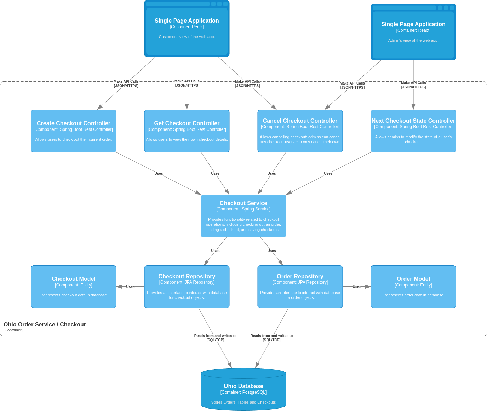
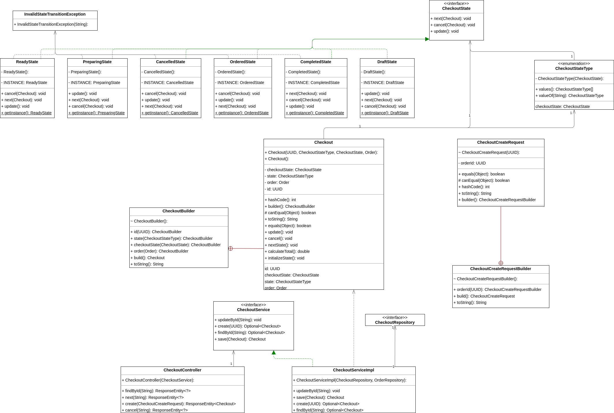
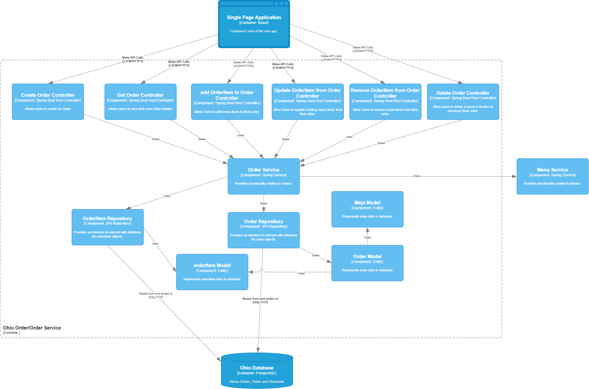
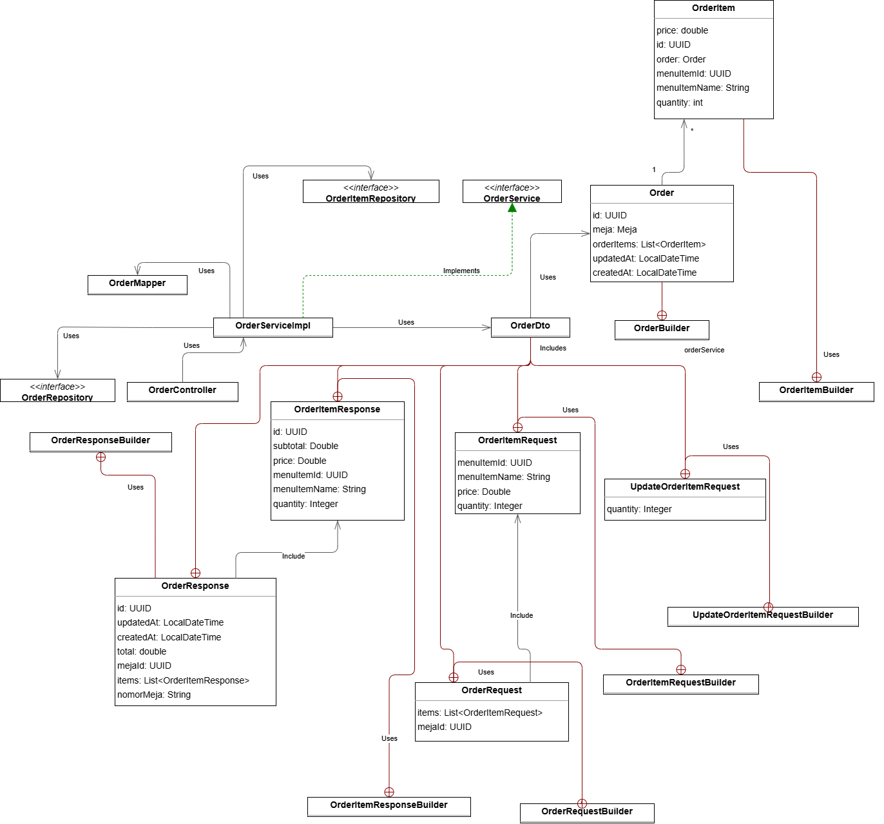

# Ohio Order Service

Handles logics of:

1. Meja (Krisna)
2. Orders (Pascal)
3. Checkouts (Vito)

## Meja Feature

### Component Diagram

### Code Diagram

## Checkout Feature

### Component Diagram

### Code Diagram

## Orders Feature

### Component Diagram

### Code Diagram

